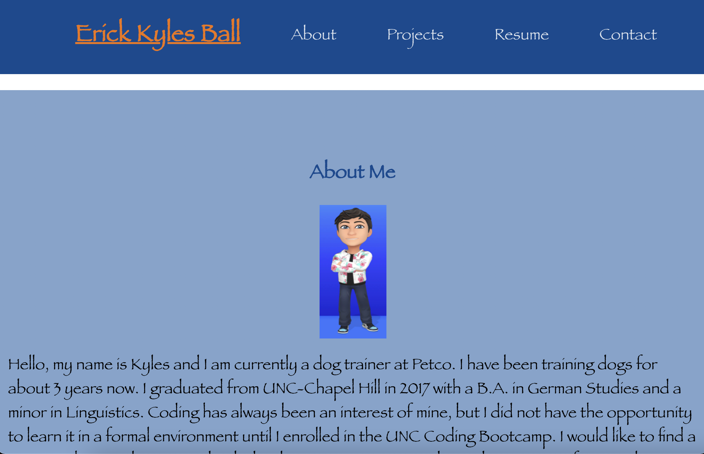

# C20-React-Portfolio

## Description

    This project was about using React to build a second portfolio. By using React, we revisited CSS styling along with a more streamlined and organized method of writing front end web pages.

## Experience Gained

   This particular assignment was more enjoyable than some of the others we have encountered. I really enjoyed using the more streamlined processes provided by React, as well as the organizational structure. It was significantly faster to find bugs in the code and refactor existing code, along with the benefit of being somewhat easier to write. However, writing the useState methods from scratch was challenging. I had to refer back to the class work and module several times, so that will be something I revisit in the future until I am more comfortable with it.

## GitHub Links (Repository and Demo Video)

    The repository link: https://github.com/ekball/C20-React-Portfolio

    The deployed site: 

## Demo React Portfolio

